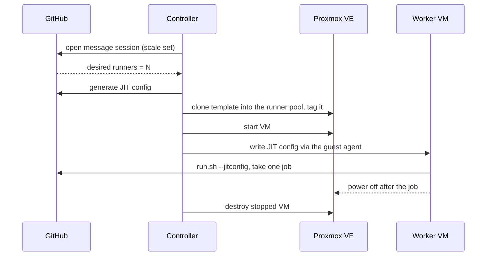

# Design notes

Why the controller is built the way it is, what it was compared against, and the Proxmox and GitHub facts the
design depends on. [AGENTS.md](../AGENTS.md) holds the invariants. This document explains them.

## The problem

Many workflows need a Docker daemon they control (`docker build`, `docker buildx`, `docker compose`, `docker run`),
`sudo`, or other privileged operations. On GitHub-hosted runners that just works, because every job gets a fresh VM.
Once you move off hosted runners (for cost, minutes, hardware, or network access), the usual self-hosted options
make this hard:

- **ARC `dind` mode** gives each runner pod a Docker-in-Docker sidecar that "requires privileged mode" and runs the
  daemon as root. A privileged container on a shared Kubernetes node is a weak boundary, especially if that node also
  runs anything holding credentials.
- **ARC `kubernetes` mode** rejects jobs without a `container:` and can't run arbitrary `docker build` or
  `docker compose`.
- **A long-lived VM runner** has Docker but keeps state between jobs, so one job can affect the next.

A fresh VM per job, cloned from a template and destroyed afterward, is how GitHub-hosted runners work. This project
does the same on Proxmox.

## How GitHub-hosted runners work

- Each job gets a new VM. The `runner` user has passwordless `sudo`, and Docker runs natively on the VM, with no
  Docker-in-Docker. Isolation comes from throwing the VM away after the job.
- Standard Linux runners for private repositories have 2 CPUs, 8 GB RAM, and a 14 GB SSD. Public repositories get
  4 CPUs and 16 GB. These numbers set the controller's default worker size.
- The 14 GB is free space for the job, not the disk size: the hosted image's preinstalled toolset takes tens of GB
  more. The controller therefore sizes each worker's disk as the template's disk plus `freeDiskGiB` (14 by default).
  A clone's disk can grow but can't be smaller than its template's, so a fixed 14 GiB disk wouldn't work anyway.
- Self-hosted runner usage is not billed. Hosted minutes on private repositories are, beyond the plan's included
  allowance.

## The runner template

The project follows ARC's model: a lean runner image, with workflows bringing their own toolchains through
`setup-*` actions. What it adds over ARC is the VM, so Docker, `systemd`, and `sudo` work without privileged
containers.

- **A prebuilt image.** CI builds the runner image with Packer (`images/runner/`) and publishes it as a release
  asset, `par-runner-<version>.qcow2`, well under GitHub's 2 GiB asset limit. The installer imports it as a template.
  Nothing is built on the node, so an install needs no build VM, no build tooling, and no extra memory or time.
- **No hosted-runner parity.** An earlier design built GitHub's full `actions/runner-images` toolset on the node:
  tens of GB, about an hour per build, a build VM, a way to run scripts in it through the guest agent (which needed
  the `VM.GuestAgent.Unrestricted` privilege), and smoke tests of candidate templates. It was dropped as far more
  machinery than a runner controller needs. The image keeps the hosted runners' directory layout and environment
  variables, so `setup-*` actions and the tool cache work. Users who need more extend the Packer build.
- **Immutable templates.** A new runner image is imported as a new template, tagged `par-tv-<import time>` and
  `par-rv-<actions/runner version>`. The controller clones the newest, tags each worker with the template it came
  from (`par-tpl-<VMID>`), and destroys an older template once no worker references it. Linked clones can't outlive
  their template, and Proxmox refuses to delete a template that clones still use, so pruning is conservative: it
  waits while any worker is being created, and stops entirely if any worker lacks the reference.
- **The 30-day rule.** A runner with auto-update disabled must be updated within 30 days of a new `actions/runner`
  release, or GitHub stops assigning it jobs. Auto-update stays disabled, as in ARC: a one-job runner that updates
  itself first downloads the runner on every job. Each runner release therefore needs a new runner image. CI opens a
  version-bump pull request for each release, and the controller checks the latest release every 6 hours and logs a
  warning once the template has been behind for 7 days and an error after 21. `parcon check template` reports the
  same. Whether the runner's own update could serve as a safety net for installations that fall behind is left to
  testing on a live node.

## Building on `actions/scaleset`

GitHub publishes the scheduling half of this controller as a Go module:
[`actions/scaleset`](https://github.com/actions/scaleset), the Runner Scale Set Client (MIT, public preview since
February 2026). It uses the same scale set APIs as ARC, which GitHub calls "the reference implementation of GitHub's
scale set APIs", and GitHub announced it for "containers, virtual machines, and bare metal". It covers:

- creating, updating, and deleting scale sets, with several labels per scale set
- a long-polling message session that reports the desired runner count
- JIT runner config generation
- GitHub App, PAT, or KMS/HSM-signed authentication

The controller supports GitHub App authentication only, identified by the App's Client ID, the installation ID, and
the private key, which is what `actions/scaleset` expects. Personal access tokens aren't supported: they belong to a
person, carry broader scopes, and break when that person leaves.

`internal/github` wraps this module rather than reimplementing the protocol. The controller writes only the Proxmox
half: clone, configure, start, deliver the JIT config, destroy. The module's README says the API is stable but the
interfaces and examples may change, so pin its version and keep the wrapper thin. The rest of the controller uses
only `internal/github`'s own types, so a change in the module touches one package.

Two properties of the module shape the controller:

- **Message handling blocks polling.** The listener calls the controller for each message and doesn't fetch the next
  one until the call returns. The controller's handler therefore only records the desired runner count and job
  events; the reconciler does the slow work of cloning and destroying VMs. The listener also returns on the first
  error of any kind, so `internal/github` re-creates the session with exponential backoff, which also covers a
  stale session left behind by a crash.
- **Runners can't be listed.** The module can look a runner up by name or ID, but it can't list a scale set's
  runners. Each worker VM is therefore named after its runner, so the reconciler can match VMs and runners by name,
  and a runner whose VM is gone is found through the VM's absence rather than by listing GitHub.

Long-polling also avoids the webhook approach. GitHub's docs warn that autoscaling from `workflow_job` webhooks
depends on webhooks arriving on time, and it needs an inbound endpoint.

## Alternatives considered

| Option | Model | Proxmox support | Verdict |
| ------ | ----- | --------------- | ------- |
| Controller on `actions/scaleset` (this project) | GitHub handles queueing and assignment. The controller provisions VMs | Proxmox VE API | Smallest surface |
| [GARM](https://github.com/cloudbase/garm) | Runner manager with external provider executables, pools, and scale sets | No Proxmox provider listed | Needs a custom provider. Adds a second control plane |
| ARC `dind` on Kubernetes | Privileged Docker sidecar per runner pod | Not applicable | Works, but relies on privileged containers on a shared node |
| Webhook-driven scaler | The controller matches `workflow_job` events and creates JIT runners | Proxmox VE API | Replaced by the scale set client, which avoids gaps in webhook delivery |

## Worker lifecycle

The controller keeps N workers in flight to match GitHub's desired count, clamped to `minRunners`/`maxRunners`. It
doesn't clone a VM for a specific job: GitHub assigns queued jobs to whichever registered runner is idle, so
`minRunners` above zero already acts as a warm pool. Proxmox is disposable capacity. A VM that exits, times out, or
is orphaned is destroyed and never reused.

### Delivering the JIT config

A JIT config is a credential: it can register a runner until it is used. It goes to the VM through the **QEMU guest
agent** (`agent/file-write`) after boot, not through cloud-init. Proxmox stores custom cloud-init user data as
snippet files on node storage and references them from the VM config, so a JIT config passed that way would stay on
disk outside the VM. The guest agent writes directly into the running guest, and the controller keeps nothing.
The guest agent creates a file before it writes the content, so the controller then writes an empty marker file, and
the runner service waits for the marker rather than the config.

Cloud-init is still used for non-secret per-VM settings such as the hostname.

### Worker state in tags

The controller keeps no state it can't rebuild. Everything durable is in each worker's Proxmox tags:

| Tag | Meaning |
| --- | ------- |
| `par-managed` | Owned by this project. VMs without it are never touched |
| `par-worker` | A worker VM |
| `par-ss-<name>` | The worker's scale set |
| `par-created-<unix>` | Creation time, for `maxLifetime` and the boot timeout |
| `par-ready` | The runner has its JIT config. Added only as the last step of creation |

A worker's VM name and runner name are both `par-<vmid>-<creation time in base 36>`, so the two can be matched even
though GitHub can't list runners, and a reused VMID never reuses a runner name. What GitHub wants (the desired count
and which runners are running jobs) is held in memory only; a new message session reports it again after a restart,
and until then the controller neither adds nor retires workers.

Creating a worker takes these steps: clone the newest template, set the worker's tags, cores, memory, network, and
DHCP, grow the root disk by `freeDiskGiB`, register the runner, start the VM, wait for the guest agent, write the JIT
config, and finally tag the worker `par-ready`.

### Failure handling

Orphaned VMs are the main way VM autoscalers fail. Every pass of the reconcile loop looks for them, and each rule is
safe to apply again after a crash:

- **Half-created workers.** A worker without `par-ready` that no operation is working on was left by a crash, and is
  destroyed rather than repaired. So is a clone that never got worker tags: it still carries the template's tags but
  isn't a template. A failed creation cleans up after itself right away, and the scale set backs off before trying
  again.
- **Finished workers.** A ready worker that powered itself off has run its job, and is destroyed.
- **Maximum lifetime.** A worker older than `maxLifetime` (6 hours by default, the hosted job limit) is destroyed even
  if its runner is still in a job.
- **Missing runners.** A ready, running worker whose runner is no longer registered in GitHub is destroyed. The check
  starts 10 minutes after creation and repeats every 5 minutes, with a bounded number of lookups per pass.
- **Removed scale sets.** Workers of a scale set that is no longer in the config are retired once they're idle, and
  the default `maxLifetime` still applies to them.
- **Retrying.** Retiring a half-created worker or one of a removed scale set waits for its runner's job. While the job
  runs, the controller asks GitHub again only at the missing-runner check interval.
- **Scaling down.** Surplus idle workers are retired oldest first. GitHub refuses to remove a runner that is running a
  job. The controller then counts that worker as busy, even if it missed the job's start, and picks another one.

Retiring a worker unregisters its runner, stops the VM, and destroys it; each step accepts that its target may already
be gone. VMIDs come from the configured range, lowest free first. An ID Proxmox reports as taken by a VM the token
can't see is skipped from then on. On shutdown the controller finishes the operations in flight but leaves running
workers alone, so restarting or upgrading it doesn't cancel jobs.

## Proxmox building blocks

- **Linked clones** are copy-on-write and fast, but "cannot run without access to the base VM Template". They work on
  qcow2, raw, or vmdk files, LVM-thin, ZFS, and RBD, but not on plain LVM or iSCSI. On those, set
  `linkedClone: false`. ([VM Templates and Clones](https://pve.proxmox.com/wiki/VM_Templates_and_Clones))
- **API tokens** default to separated privileges: the effective rights are the intersection of the user's and the
  token's ACLs. ([User Management](https://pve.proxmox.com/wiki/User_Management))
- **Scope everything to a resource pool.** Grant the VM privileges on the runner pool only (the templates live there
  too), and the datastore and SDN privileges on the target storage and the worker VNet only. The token then can't
  touch any other VM on the cluster, including the controller and gateway VMs in `par-system`.
- **Guest-agent privileges** changed between releases. PVE 9 splits them into `VM.GuestAgent.Audit`, `FileRead`,
  `FileWrite`, `FileSystemMgmt`, and `Unrestricted`. Earlier releases gate the agent behind `VM.Monitor`. The
  controller needs only `Audit` for `agent/ping` and `FileWrite` for `agent/file-write` (JIT delivery). Without
  `Unrestricted` the token can't run commands in a VM. List each privilege in the role by name rather than writing
  `VM.Config.*` or `VM.GuestAgent.*`.
- **Clone permissions:** cloning needs `VM.Clone` on the source and `VM.Allocate` on the new VMID or on the target
  pool. Growing the clone's disk needs `VM.Config.Disk`.
- **Seeing pools:** `/cluster/resources` reports a VM's `pool` only to callers with `Pool.Audit` on it. Without it
  the controller can't tell its VMs from others, so the token needs it (found on PVE 9.2).
- **Missing VMs look forbidden.** The token's rights come from the pool's ACL, and a VM that no longer exists isn't
  in the pool, so Proxmox answers requests for it with `403 Permission check failed`, not "does not exist" (found on
  PVE 9.2). When destroying a VM fails with 403, the controller checks the VM list and counts a VM that isn't
  listed as already destroyed.
- **`/cluster/resources` lags.** VM tags there are current, but `status` and `template` come from `pvestatd` and
  trail reality by up to about 10 seconds (measured on PVE 9.2): a fresh clone is `unknown` with the template's
  tags, a started VM stays `unknown` for about 4s, a stopped VM still shows `running` for about 9s, and a new
  template shows `template: 0` for about 9s. The controller treats `unknown` as "don't know yet" and acts only on
  an explicit `stopped`. A new template with a late flag looks exactly like a half-created worker clone, which also
  carries the template's tags, so they are told apart by VMID: workers take IDs from the start of the range, and
  the last `ReservedVMIDs` IDs hold templates and the installer's smoke-test clones. The controller never treats a
  VM in the reserved IDs as a worker or a leftover, and uses a template there only once Proxmox reports it as one.

Check endpoint names and privileges against the installed Proxmox VE version. The API viewer is the authoritative
reference.

## Capacity

Runner VMs compete with everything else on the node. Before raising `maxRunners`, check the node's physical cores,
RAM, and free space on the clone storage, and count how many vCPUs are already allocated to other VMs. Start with low
concurrency and raise it only after measuring contention. Queue time, clone latency, and job duration in the
controller's metrics are the signals to watch.

## Network isolation

Workers run untrusted code and should be treated as hostile to everything around them. Home labs and company
networks differ too much to rely on the user's bridges, VLANs, or router rules, so the project brings its own
network:

- Workers attach only to an isolated SDN VNet with no uplink and no host IP. The host acts as a switch for it and
  never routes worker traffic.
- A small gateway VM with one NIC on the LAN and one on the worker network is the only way out. It serves DHCP and
  DNS, NATs outbound traffic, and drops traffic to the LAN, the Proxmox host, the controller VM, and private and
  link-local ranges.
- The controller never talks to workers over the network. It uses the Proxmox API and the guest agent.

Alternatives considered:

| Option | Why not |
| ------ | ------- |
| Workers on an existing bridge or VLAN | Isolation depends on the user's switch and router setup, which the installer can't check |
| SDN simple zone with SNAT, with the host as gateway | The host routes untrusted traffic, isolation depends on the host's firewall setup, and host DHCP needs the `dnsmasq` package |
| Route through the controller VM | Puts hostile traffic next to the VM that holds the secrets |

Don't bake reusable credentials (VPN keys, registry passwords, cloud keys) into the template. Jobs that need network
access should get short-lived credentials at run time, for example through GitHub OIDC. See
[install.md](install.md#networking) for the network details.

## Trust levels and scale sets

Use separate scale sets for jobs with different trust levels. For example, keep jobs that build untrusted code apart
from jobs that hold deployment secrets. Workflows then pick the right one by label, and GitHub runner groups control
which repositories and workflows may use each scale set. One-job VMs already stop one job from seeing another job's
data.

All scale sets share one worker network and one runner pool. Separate networks or pools per scale set were
considered and dropped: they would multiply the gateway and SDN setup for little gain over one-job VMs on a network
that can only reach the internet.

## Sources

Opened on 2026-09-24:

- [About GitHub-hosted runners](https://docs.github.com/en/actions/reference/runners/github-hosted-runners)
- [Self-hosted runners reference](https://docs.github.com/en/actions/reference/runners/self-hosted-runners)
- [Deploying runner scale sets with ARC](https://docs.github.com/en/actions/tutorials/use-actions-runner-controller/deploy-runner-scale-sets)
- [GitHub Actions billing](https://docs.github.com/en/billing/concepts/product-billing/github-actions)
- [actions/scaleset](https://github.com/actions/scaleset)
- [GitHub Changelog, 2026-02-05](https://github.blog/changelog/2026-02-05-github-actions-early-february-2026-updates/)
- [GARM](https://github.com/cloudbase/garm)
- [Proxmox VE: VM Templates and Clones](https://pve.proxmox.com/wiki/VM_Templates_and_Clones)
- [Proxmox VE: User Management](https://pve.proxmox.com/wiki/User_Management)
- [Registering a GitHub App from a manifest](https://docs.github.com/en/apps/sharing-github-apps/registering-a-github-app-from-a-manifest)
- [Generating a user access token for a GitHub App (device flow)](https://docs.github.com/en/apps/creating-github-apps/authenticating-with-a-github-app/generating-a-user-access-token-for-a-github-app)
