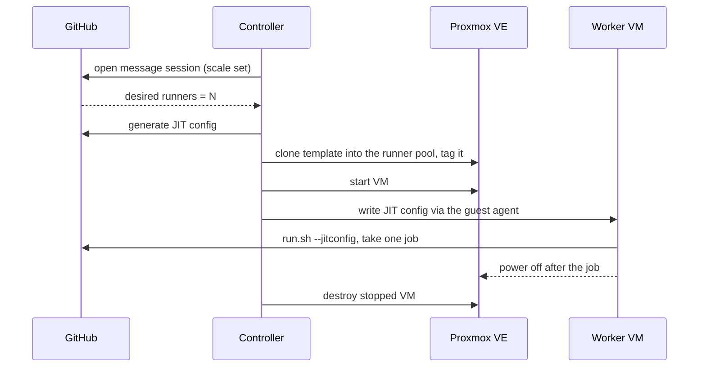

# Design notes

Why the controller is built the way it is, what it was compared against, and the Proxmox and GitHub facts the
design depends on. [AGENTS.md](../AGENTS.md) holds the invariants. This document explains them.

## The problem

Many workflows need a Docker daemon they control (`docker build`, `docker buildx`, `docker compose`, `docker run`),
`sudo`, or other privileged operations. On GitHub-hosted runners that just works, because every job gets a fresh VM.
Once you move off hosted runners (for cost, minutes, hardware, or network access), the usual self-hosted options
make this hard:

- **ARC `dind` mode** gives each runner pod a Docker-in-Docker sidecar that "requires privileged mode" and runs the
  daemon as root. A privileged container on a shared Kubernetes node is a weak boundary, especially if that node also
  runs anything holding credentials.
- **ARC `kubernetes` mode** rejects jobs without a `container:` and can't run arbitrary `docker build` or
  `docker compose`.
- **A long-lived VM runner** has Docker but keeps state between jobs, so one job can affect the next.

A fresh VM per job, cloned from a template and destroyed afterward, is how GitHub-hosted runners work. This project
does the same on Proxmox.

## How GitHub-hosted runners work

- Each job gets a new VM. The `runner` user has passwordless `sudo`, and Docker runs natively on the VM, with no
  Docker-in-Docker. Isolation comes from throwing the VM away after the job.
- Standard Linux runners for private repositories have 2 CPUs, 8 GB RAM, and a 14 GB SSD. Public repositories get
  4 CPUs and 16 GB. These numbers set the controller's default worker size.
- Self-hosted runner usage is not billed. Hosted minutes on private repositories are, beyond the plan's included
  allowance.

## Building on `actions/scaleset`

GitHub publishes the scheduling half of this controller as a Go module:
[`actions/scaleset`](https://github.com/actions/scaleset), the Runner Scale Set Client (MIT, public preview since
February 2026). It uses the same scale set APIs as ARC, which GitHub calls "the reference implementation of GitHub's
scale set APIs", and GitHub announced it for "containers, virtual machines, and bare metal". It covers:

- creating, updating, and deleting scale sets, with several labels per scale set
- a long-polling message session that reports the desired runner count
- JIT runner config generation
- GitHub App, PAT, or KMS/HSM-signed authentication

`internal/github` wraps this module rather than reimplementing the protocol. The controller writes only the Proxmox
half: clone, configure, start, deliver the JIT config, destroy. The module's README says the API is stable but the
interfaces and examples may change, so pin its version and keep the wrapper thin.

Long-polling also avoids the webhook approach. GitHub's docs warn that autoscaling from `workflow_job` webhooks
depends on webhooks arriving on time, and it needs an inbound endpoint.

## Alternatives considered

| Option | Model | Proxmox support | Verdict |
| ------ | ----- | --------------- | ------- |
| Controller on `actions/scaleset` (this project) | GitHub handles queueing and assignment. The controller provisions VMs | Proxmox VE API | Smallest surface |
| [GARM](https://github.com/cloudbase/garm) | Runner manager with external provider executables, pools, and scale sets | No Proxmox provider listed | Needs a custom provider. Adds a second control plane |
| ARC `dind` on Kubernetes | Privileged Docker sidecar per runner pod | Not applicable | Works, but relies on privileged containers on a shared node |
| Webhook-driven scaler | The controller matches `workflow_job` events and creates JIT runners | Proxmox VE API | Replaced by the scale set client, which avoids gaps in webhook delivery |

## Worker lifecycle

The controller keeps N workers in flight to match GitHub's desired count. Proxmox is disposable capacity. A VM that
exits, times out, or is orphaned is destroyed and never reused.

### Delivering the JIT config

A JIT config is a credential: it can register a runner until it is used. It goes to the VM through the **QEMU guest
agent** (`agent/file-write`) after boot, not through cloud-init. Proxmox stores custom cloud-init user data as
snippet files on node storage and references them from the VM config, so a JIT config passed that way would stay on
disk outside the VM. The guest agent writes directly into the running guest, and the controller keeps nothing.

Cloud-init is still used for non-secret per-VM settings such as the hostname.

### Failure handling

Orphaned VMs are the main way VM autoscalers fail. The controller guards against them in several ways:

- **Startup reconciliation.** On start, rebuild state from Proxmox tags and GitHub runners, then clean up.
- **Reaper.** Destroy managed VMs that have no matching GitHub runner past a grace period, and remove GitHub runners
  that have no VM.
- **Maximum lifetime.** Destroy any worker older than `maxLifetime`, 6 hours by default to match the hosted job
  limit.
- **Retries.** Retry clone, start, and destroy with backoff. A half-created clone is destroyed, not repaired.

## Proxmox building blocks

- **Linked clones** are copy-on-write and fast, but "cannot run without access to the base VM Template". They work on
  qcow2, raw, or vmdk files, LVM-thin, ZFS, and RBD, but not on plain LVM or iSCSI. On those, set
  `linkedClone: false`. ([VM Templates and Clones](https://pve.proxmox.com/wiki/VM_Templates_and_Clones))
- **API tokens** default to separated privileges: the effective rights are the intersection of the user's and the
  token's ACLs. ([User Management](https://pve.proxmox.com/wiki/User_Management))
- **Scope everything to a resource pool.** Grant `VM.Clone` on the template only. Grant the VM privileges on the
  runner pool only, and the datastore and SDN privileges on the target storage and bridge only. The token then can't
  touch any other VM on the cluster.
- **Guest-agent privileges** changed between releases. PVE 9 splits them into `VM.GuestAgent.*`. Earlier releases
  gate the agent behind `VM.Monitor`. Check the privilege names against the installed version.

Check endpoint names and privileges against the installed Proxmox VE version. The API viewer is the authoritative
reference.

## Capacity

Runner VMs compete with everything else on the node. Before raising `maxRunners`, check the node's physical cores,
RAM, and free space on the clone storage, and count how many vCPUs are already allocated to other VMs. Start with low
concurrency and raise it only after measuring contention. Queue time, clone latency, and job duration in the
controller's metrics are the signals to watch.

## Network isolation

Workers run untrusted code and should be treated as hostile to everything around them:

- Put workers on a dedicated bridge or VLAN with internet egress.
- Use the Proxmox firewall (or the router) to deny the management network, the Proxmox API, and the controller host.
  Allow only the gateway and DNS.
- Don't bake reusable credentials (VPN keys, registry passwords, cloud keys) into the template. Jobs that need
  network access should get short-lived credentials at run time, for example through GitHub OIDC.

## Trust levels and scale sets

Use separate scale sets for jobs with different trust levels. For example, keep jobs that build untrusted code apart
from jobs that hold deployment secrets. Workflows then pick the right one by label. One-job VMs already stop one job
from seeing another job's data, but separate scale sets also let you give them different networks and
different Proxmox pools.

## Sources

Opened on 2026-09-24:

- [About GitHub-hosted runners](https://docs.github.com/en/actions/reference/runners/github-hosted-runners)
- [Self-hosted runners reference](https://docs.github.com/en/actions/reference/runners/self-hosted-runners)
- [Deploying runner scale sets with ARC](https://docs.github.com/en/actions/tutorials/use-actions-runner-controller/deploy-runner-scale-sets)
- [GitHub Actions billing](https://docs.github.com/en/billing/concepts/product-billing/github-actions)
- [actions/scaleset](https://github.com/actions/scaleset)
- [GitHub Changelog, 2026-02-05](https://github.blog/changelog/2026-02-05-github-actions-early-february-2026-updates/)
- [GARM](https://github.com/cloudbase/garm)
- [Proxmox VE: VM Templates and Clones](https://pve.proxmox.com/wiki/VM_Templates_and_Clones)
- [Proxmox VE: User Management](https://pve.proxmox.com/wiki/User_Management)
